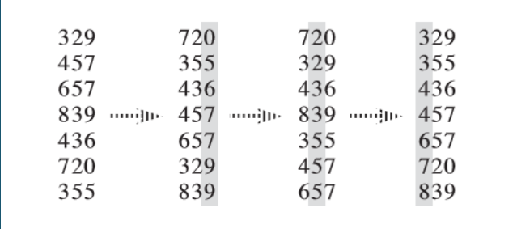

# 排序

> 排序算法（英文：Sorting algorithm）是一种将一组特定的数据按某种顺序进行排列的算法。

## 选择排序

> 选择排序（英语：Selection sort）是一种简单直观的排序算法。它的工作原理是每次找出第$i$小的元素（也就是$A_{i..n}$中最小的元素），然后将这个元素与数组第$i$个位置上的元素交换。

### 稳定性

由于 swap（交换两个元素）操作的存在，选择排序是一种不稳定的排序算法。

### 时间复杂度

选择排序的最优时间复杂度，平均复杂度和最坏时间复杂度均为$O(n^2)$。

### 代码

```C++
void selection_sort(int* a, int n) {
  for (int i = 1; i < n; ++i) {
    int ith = i;
    for (int j = i + 1; j <= n; ++j) {
      if (a[j] < a[ith]) {
        ith = j;
      }
    }
    int t = a[i];
    a[i] = a[ith];
    a[ith] = t;
  }
}
```

## 冒泡排序

> 冒泡排序（英语：Bubble sort）是一种简单的排序算法。由于在算法的执行过程中，较小的元素像是气泡般慢慢「浮」到数列的顶端，故叫做冒泡排序。

### 工作原理

每次检查相邻两个元素，如果前面的元素与后面的元素满足给定的排序条件，就将相邻的两个元素交换。当没有相邻的元素交换时，排序完成了。

经过$i$次扫描后，数列的，末尾$i$项必然时最大的$i$项，因此冒泡排序最多需要扫描$n-1$遍数组就能完成排序。

### 稳定性

冒泡排序是一种不稳定的排序算法

### 时间复杂度

在序列完全有序时，冒泡排序只需要遍历一遍数组，不用执行任何交换操作，时间复杂度为$O(n)$。在最坏情况下，冒泡排序要执行$\frac{(n-1)n}{2}$次交换操作，时间复杂度为$O(n^2)$。冒泡排序的平均时间复杂度为$O(n^2)$。

### 代码实现

```C++
void bubble_sort(int * a,int n){
bool flag=true;
    while(flag){
        flag=false;
        for(int i=1;i<n;++i){
            if(a[i]>a[i+1]){
                flag=true;
                int t=a[i+1];
                a[i]=a[i+1];
                a[i+1]=t;
            }
        }
    }
}
```

## 插入排序

> 插入排序（英语：Insertion sort）是一种简单直观的排序算法。它的工作原理为将待排列元素划分为“已排序”和“未排序”两部分，每次从“未排序的”元素中选择一个插入到“已排序的”元素中的正确位置。

### 稳定性

插入排序是一种稳定的排序算法。

### 时间复杂度

插入排序的最优时间复杂度为$O(n)$，在数列几乎有序时效率最高。插入排序的最坏时间复杂度和平均复杂度都为$O(n^2)$。

### 代码实现

```C++
void insertion_sort(int*a,int n){
    //对a[0],...a[n]进行插入排序
    for(int i=1;i<=n;++i){
        int key=a[i];
        int j=i-1;
        while(j>0&&a[j]>key){
            a[j+1]=a[j];
            --j;
        }
        a[j+1]=key;
    }
}
```

## 计数排序

> 计数排序（英语：Counting sort）时一种线性时间的排序算法

### 工作原理

计数排序的工作原理是使用一个额外的数组$C$，其中第$i$个元素是待排序数组$A$中值等于$i$的元素的个数，然后根据数组$C$来将$A$中的元素排到正确的位置。

工作过程：

1. 计算每个数出现了几次；
2. 求出每个数出现的*前缀和*；
3. 利用出现次数的前缀和，从右到左计算每个数的排名

### 稳定性

计数排序是一种稳定的排序算法。

### 时间复杂度

计数排序的时间复杂度为$O(n+w)$，其中$w$代表待排序数据的值域大小

### 代码实现

```c++
const int N=100010;
const int W=100010;

int n,w,a[N],cnt[W],b[N];

void counting_sort(){
    memset(cnt,0,sizeof(cnt));
    for(int i=1;i<=n;++i)++cnt[a[i]];	//计算每个数出现了几次
    for(int i=1;i<=W;++i)cnt[i]+=cnt[i-1];	//求出每个数出现次数的前缀和
    for(int i=n;i>=1;--i)b[cnt[a[i]]--]=a[i];
}
```

## 基数排序

> 基数排序（英语：Radix sort）是一种非比较型的排序算法，最早用于解决卡片排序的问题。

### 工作原理

它的工作原理是将待排序的元素拆分为$k$个关键字（比较两个元素时，先比较第一关键字，如果相同再比较第二关键字……），然后先对第$k$关键字进行稳定排序，再对第$k-1$关键字进行稳定排序，再对第$k-2$关键字进行稳定排序……最后对第一关键字进行稳定排序，这样就完成了对整个待排序序列的稳定排序。



基数排序需要借助一种稳定算法完成内层对关键字的排序。

注意：**通常而言，基数排序比基于比较的排序算法（比如快速排序）要快。但由于需要额外的内存空间，因此当内存稀缺时，原地置换算法（比如快速排序）或许是个更好的选择。**

### 稳定性

基数排序是一种稳定的排序算法。

### 时间复杂度

一般来说，如果每个关键字的值域都不大，就可以使用 [计数排序](https://oi-wiki.org/basic/counting-sort/) 作为内层排序，此时的复杂度为$O(kn+\sum\limits_{i=1}^k w_i)$，其中$w_i$为第$i$个关键字的值域大小。如果关键字值域很大，就可以直接使用基于比较的$O(nk\log n)$排序而无需基数排序。

### 空间复杂度

基数排序的空间复杂度为$O(k+n)$。

### 算法实现

```c++
const int N = 100010;
const int W = 100010;
const int K = 100;

int n, w[K], k, cnt[W];

struct Element{
    int key[k];
    
    bool operator<(const Element& y)const{
        for(int i=1;i<=k;++i){
            if(key[i]==y.key[i])continue;
            return key[i]<y.key[i];
        }
       return false; 
    }
}a[N],B[N];

void counting_sort(int p){
    memset(cnt, 0, sizeof(cnt));
  for (int i = 1; i <= n; ++i) ++cnt[a[i].key[p]];
  for (int i = 1; i <= w[p]; ++i) cnt[i] += cnt[i - 1];
  // 为保证排序的稳定性，此处循环i应从n到1
  // 即当两元素关键字的值相同时，原先排在后面的元素在排序后仍应排在后面
  for (int i = n; i >= 1; --i) b[cnt[a[i].key[p]]--] = a[i];
  memcpy(a, b, sizeof(a));
}

void radix_sort() {
  for (int i = k; i >= 1; --i) {
    // 借助计数排序完成对关键字的排序
    counting_sort(i);
  }
}
```

## 快速排序

> 快速排序（英语：Quicksort），又称分区交换排序（英语：partition-exchange sort），简称快排，是一种被广泛运用的排序算法。

### 基本原理与实现

快速排序的工作原理是通过*分治*的方式将一个数组排序。

快速排序分为三个步骤：

1. 将数列划分为两个部分（要求保证相对大小关系）
2. 递归到两个子序列中分别进行快速排序。
3. 不用合并，因为此时数列已经完全有序。

和*归并排序*不同，第一步并不是直接分为前后两个序列，而是在分的过程中要保证相对大小关系。具体来说，第一步要是要把数列分成两个部分，然后保证前一个子数列中的数都小于后一个子数列中的数。为了保证平均时间复杂度，一般是随机选择一个数$m$来当做两个子数列的分界。

之后，维护一前一后两个指针$p$和$q$，依次考虑当前的数是否放在了应该放的位置。如果当前的数没有放对，比如说如果后面的指针$q$遇到了一个比 $m$小的数，那么可以交换$p$和$q$位置上的数，再把$q$向后移一位。当前的数的位置全放对后，再移动指针继续处理，直到两个指针相遇。

### 代码实现

```c++
int Paritition(int A[],int low,int high){
    int pivot=A[low];
    while(low<high){
        while(low<high&&A[high]>=pivot){
            high--;
        }
        A[low]=A[high];
        while(low<high&&A[low]<=pivot){
            low++;
        }
        A[high]=A[low];
    }
    A[low]=pivot;
    return low;
}
void QuickSort(int A[],int low,int high){
    if(low<high){
        int pivot=Paritition(A,low,high);
        QuickSort(A,low,pivot-1);
        QUickSort(A,pivot+1,high); 
    }
}
```

### 稳定性

快速排序是一种不稳定的排序方法。

### 时间复杂度

快速排序的最优时间复杂度和平均时间复杂度为$O(nlogn)$，最坏时间复杂度为$O(n^2)$。对于最优情况，每一次选择的分界值都是序列的中位数，此时算法时间复杂度满足的递推方式为$T(n)=2T(\frac{n}{2})+\Theta(n)$,由主定理,$T(n)=\Theta(n\log{n})$。

对于最坏情况，每次选择的分界值都是序列的中位数，此时算法时间复杂度满足的递推公式为$T(n)=T(n-1)+\Theta(n)$，累加可得$T(n)=\Theta(n^2)$。

对于平均情况，每一次选择的分界值可以看作是等概率随机的。这种情况下的时间复杂度是$O(n\log{n})$。

## 归并排序

> 归并排序（英语：merge sort）是采用了分治思想的排序方法

### 工作原理

归并排序分为三个步骤：

1. 将数列划分为两部分；
2. 递归地分别对两个子序列进行归并排序；
3. 合并两个子序列。

### 稳定性

归并排序是稳定的排序算法

### 时间复杂度

归并排序的最优时间复杂度，平均复杂度和最坏时间复杂度均为$O(n\log{n})$。

归并排序的空间复杂度为$O(n)$。

### 代码实现

```c++
void merge(int a[],int left,int right){
    if(right-left<=1)return; //升序或者降序自行处理再返回
    int mid=left+(right-left>>1);
    merge(a,left,mid);
    merge(a.mid,right);
    int p=left,q=mid,s=left;
    while(left<right){
        if(p>=mid||(q<right&&a[p]>a[q])){
            t[s++]=a[q++];
            //ans+=mid-p;
        }else{
            t[s++]=a[p++];
        }
    }
    for(int i=left;i<right;++i) a[i]=t[i];
}
```

### 逆序对

归并排序还可以用来球逆序对的个数。

> 逆序对：对于一个数组$a$,满足$a_i>a_j$,且$i<j$的数对$(i,j)$。

代码实现中注释掉的`ans+=mid-p`就是在统计逆序对个数。

## 堆排序

> 堆排序(英语：heapsort)是指利用二叉堆这种数据结构所设计的一种排序算法。堆排序的适用数据结果为数组。

### 工作原理

本质是建立在堆上的选择排序。

1. 建立大堆
2. 将堆顶元素取出，作为最大值，与数组尾部的元素交换，并维持残余堆的性质；
3. 将堆顶元素取出，作为次大值，与数组倒数第二为元素交换，并维持残余堆的性质。以此类推，在第$n-1$次操作后，整个数组就完成了排序

### 在数组上建立二叉堆

从根节点开始，依次将每一层的节点排列在数组里。

于是由数组中下标为$i$的节点，对应的父节点，左子节点和右子节点如下：

```c++
iParent(i)=(i-1)/2
iLeftChild(i)=2*i+1;
iRightChild(i)=2*i+2;
```

### 稳定性

同选择排序一样，由于其中交换位置的操作，所以是不稳定的排序算法。

### 时间复杂度

堆排序的最优时间复杂度，平均时间复杂度，最坏时间复杂度均为$O(n\log{n})$。

### 代码实现

```c++
void sift_down(int arr[],int start,int end){
    int parent =start;
    int child=parent*2+1;
    while(child<=end){
        //先比较两个子节点大小，选择最大的
        if(child+1<=end&&arr[child]<arr[child+1])child++;
        //如果父节点比子节点打，代表调整完毕，直接跳出函数
        if(arr[parent]>=arr[child])return;
        else{
            //否则交换父子内容，字节点再和孙节点比较
            swap(arr[parent],arr[child]);
            parent=child;
            child=parent*2+1;
        }
    }
}
void heap_sort(int arr[],int len){
    for(int i=(len-1-1)/2;i>=0;i--)sift_down(arr,i,len-1);
    for(int i=len-1;i>0;i--){
        swap(arr[0],arr[i]);
        sift_down(arr,0,i-1);
    }
}
```

## 桶排序

> 桶排序（英文：Bucket sort）是排序算法的一种，适用于待排序数据值域较大但分布比较均匀的情况。

### 工作原理

桶排序按下列步骤进行：

1. 设置一定量的数组当空桶；
2. 遍历序列，并将元素一个个放入对应的桶中；
3. 对每个不是空的桶进行排序；
4. 从不是空的桶里把元素再放回原来的序列中。

### 稳定性

如果使用稳定的内层排序，并且将元素插入桶中时不改变元素间的相对顺序，那么桶排序就是一种稳定的排序算法。

由于每块元素不多，一般使用插入排序。此时桶排序就是一种稳定的排序算法。

### 时间复杂度

同排序的平均时间复杂度为$O(n+\frac{n^2}{k}+k)$，当$k\approx n$时为$O(n^2)$。

### 代码实现

```c++
const int N=100010;
int n,w,a[N];
vector<int>bucket[N];

void insertion_sort(vector<int>& A){
    for(int i=1;i<A.size();++i){
        int key=A[i];
		int j=i-1;
        while(j>=0&&A[j]>key){
            A[j+1]=A[j];
            --j;
        }
        A[j+1]=key;
    }
}

void bucket_sort(){
    int buket_size=w/n+1;
    for(int i=0;i<n;++i){
        bucket[i].clear();
        
    }
    for(int i=1;i<=n;++i){
        bucket[a[i]/bucket_size].push_back(a[i]);
        
    }
    int p=0;
    for(int i=0;i<n;++i){
        insertion_sort(bucket[i]);
        for(int j=0;j<bucket[i].size();++j){
            a[++p]=bucket[i][j];
        }
    }
}
```

